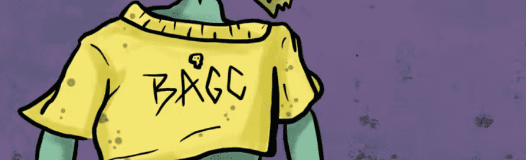

# BAGC

5000 只无聊的猿地精为你生成面对 web 3。所有 180 多个特征都是手绘并一起生成的，以制作这些美丽的虾虎鱼。

BAGC NFT - 常见问题（FAQ）
▶ 什么是 BAGC？
BAGC 是一个 NFT（Non-fungible token）集合。存储在区块链上的数字艺术品集合。
▶ 有多少个 BAGC 代币？
总共有 1,283 个 BAGC NFT。目前 250 位车主的钱包中至少有一个 BAGC NTF。
▶ 最昂贵的 BAGC 销售是什么？
售出的最昂贵的 BAGC NFT 是 Bored Ape Goblin Club #124。它于 2022 年 6 月 17 日（2 个月前）以 38.1 美元的价格售出。
▶ 最近卖出了多少个 BAGC？
过去 30 天内售出了 17 个 BAGC NFT。
▶ 一个 BAGC 的费用是多少？
过去 30 天，BAGC NFT 最便宜的销售额低于 1 美元，最高销售额超过 22 美元。过去 30 天 BAGC NFT 的中位价格为 6 美元。
▶ 什么是流行的 BAGC 替代品？
许多拥有 BAGC NFT 的用户还拥有 DerpLife、 CryptoDragons.CD、 Bored Ape REMIXED！和 Volcom Metaboard。

