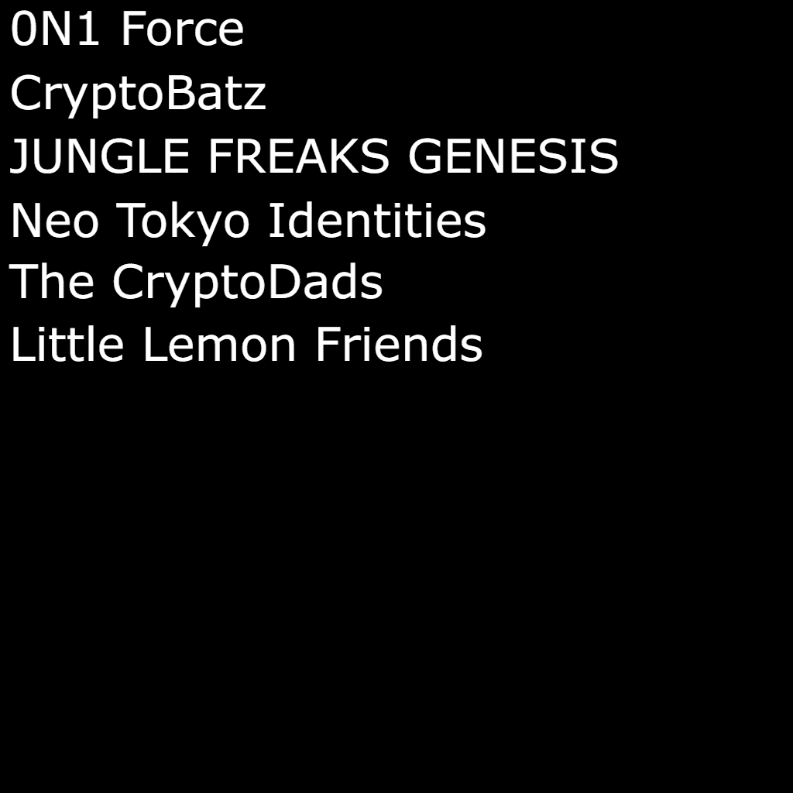

# Bags (for Bagholders)

袋子是随机的袋子，并存储在链上。故意省略统计信息、图像和其他功能以供其他人解释。随意以任何你想要的方式使用包。

袋子（用于袋子） NFT - 常见问题（FAQ）
▶ 什么是包（用于包袋）？
Bags (for Bagholders) 是一个 NFT (Non-fungible token) 集合。存储在区块链上的数字艺术品集合。
▶ 有多少 Bags (for Bagholders) 代币？
总共有 999 个 Bags（用于 Bagholders）NFT。目前，270 位车主的钱包中至少有一个 Bags (for Bagholders) NTF。
▶ 什么是最昂贵的包（用于 Bagholders）销售？
最昂贵的 Bags (for Bagholders) NFT 是 Bags (for Bagholders) #960。它于 2022-06-06（3 个月前）以 5.4 美元的价格售出。
▶ 最近卖出了多少包（用于包袋）？
过去 30 天内售出了 49 个 Bags（用于 Bagholders）NFT。
▶ 一个袋子（用于袋子持有人）的价格是多少？
在过去 30 天里，最便宜的 Bags (for Bagholders) NFT 销售额低于 5 美元，最高销售额超过 22 美元。过去 30 天内，Bags（针对 Bagholders）NFT 的中位价格为 15 美元。
▶ 什么是流行的 Bags (for Bagholders) 替代品？
许多拥有 Bags (for Bagholders) NFT 的用户还拥有 fgfdgdgdgdgdfgasfgsfgafg、 My Little Miner Stake Minter、 trollstown.wtf和 SACRIFICE NFT。

