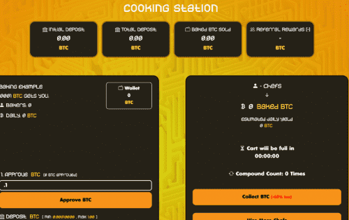
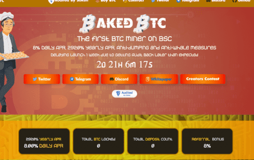

# BakedBTC

Baked BTC 是一个基于币安智能链的去中心化应用程序。游戏的目标是比其他玩家更快、更频繁地雇佣更多的厨师。这反过来又可以让你更快地获得更多的 BTC。这些厨师不知疲倦地为您工作，平均每天为您提供厨师价值的 8%。每日百分比回报取决于玩家在平台内采取的影响厨师效率的行动。随着用户购买 Chefs、重新雇用您的收入并以 BTC 出售您的 Chefs，厨师效率会上升和下降。

Baked BTC 制定了多项反倾销和反鲸鱼措施，以确保项目的寿命。这些措施包括最大存款，以及取款的截止时间和冷却时间。截止时间是您的“购物车”装满奖励所需的时间。一旦袋子装满，它将停止填充，直到您在游戏中采取了一些行动。这是为了防止鲸鱼让他们的奖励长期累积，并消除当大部分奖励是鲸鱼等待立即提取的奖励时，合约价值正在上涨的错误印象。退出冷却时间是一个人必须等待的时间，然后才能进行另一次退出。这也可以防止合约余额过快贬值。

我们与其他矿工有何不同&nbsp;

复合计数是用户复合的次数。默认情况下，平台要求的复利数为5，这意味着用户必须复利5次（每12小时复利一次）才能退出，而无需支付60%的反馈税。此功能本质上将确保项目的寿命和稳定性。为了奖励复合的用户，当您重新雇用您的每日厨师收入而不是出售他们时，会有奖金。

