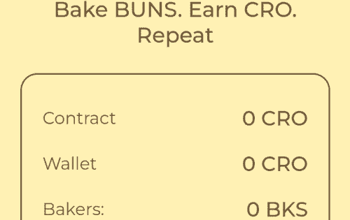

# BakedBuns.Farm

Cronos 链上的去中心化面包店在 $CRO 中产生 6% 的每日投资回报率&nbsp;

几乎每个人都渴望通过可持续的+高产农业来投入一些诚实的钱，这就是我们在 CRONOS 厨房背后一直在努力的事情！&nbsp;

聘请面包师 &amp; 开始烘焙 > 每天重新烘烤 6% > $CRO 工资支票

# **为什么选择我们？**

BakedBuns.Farm 部署在 Crypto.com 的 Cronos 网络上，这是加密空间中最有前途的链之一。

我们认为这是积累 CRO 的好时机，因为它具有巨大的潜力，我们相信 CRO 将在接下来的几个月中成为 Top 10 代币。

3% 的押金费用将重新投入到生态系统开发和市场营销中，以促进项目增长。因此，团队成员将通过自己对平台的投资来赚钱，这迫使我们所有人努力工作来维持和改进项目。

我们的路线图雄心勃勃。我们的目标是创建一个以矿工为中心的跨链生态系统。我们项目的目标是使我们的烘焙农场能够自我维持并且不依赖新用户的存款。

# 
