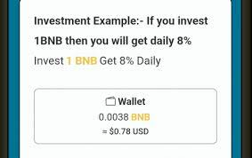

# Bakedpeanuts

烤花生是最好的&amp; 在 BSC 上发展 BNB 的可持续方式。 投资者每天可赚取高达 8% 的收益 12% 的推荐。 Bakedpeanuts 是增长最快的 BNB 矿工。

## 欢迎来到**烘焙**花生

在币安智能链上增长 BNB 的一种智能且可持续的方式。

 8% 每日 ~ 2920% 年利率

 0% 每日复合红利

0% 推荐

## 什么是烤花生？

Bakedpeanuts 是一款基于币安智能链的去中心化游戏。游戏的目的是比其他玩家更快、更频繁地雇佣更多的矿工。这反过来又可以更快地为您赚取更多的 BNB。这些矿工不知疲倦地为你工作，平均每天支付你初始 BNB 投资的 8%。每日百分比回报取决于用户在平台内采取的影响矿工效率的行动。挖矿效率随着用户雇佣矿工、复合收益和口袋 BNB 奖励而上升和下降。一旦矿工被雇佣，他们就不能被出售，购买他们的投资（通过存款或复利）也不能收回。
