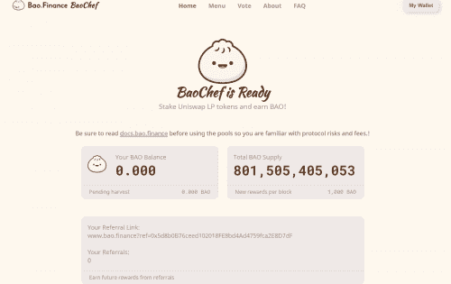

# Bao.Finance

Bao 将创建我们所谓的“第二层”协议。

这是因为我们不会将 Bao 设计为直接存入，而是构建我们的功能以在现有系统中工作。

用户将使用来自 Uniswap 的资产以及很快的 SushiSwap 和 Balancer 参与 Bao 生态系统。

我们将自己视为第一个 L2 DeFi，旨在将我们协议的功能添加到现有基础设施之上。

# 宝愿景

传统金融行不通。长期以来，它一直在为有钱人服务，同时为其他所有人设置进入壁垒。他们拥有数据，限制工具，并更改规则以始终对他们有利。现在是时候不仅将这种权力还给人们，而且还要创造出更强大的工具，这是旧的笨重系统做梦也想不到的。

在Bao Finance，我们正在建立一个由聪明才智组成的社区，他们都在寻求控制自己的财务，并建立一个适合所有人的新系统。合成资产使我们能够创造前所未有的金融工具和市场。如果数据存在，那么它的市场也可以存在——可能性是无穷无尽的。这一切都归结为数据。大多数人没有意识到金融数据是使机构如此强大的原因，以及为什么你不能做他们所做的事情，这就是合成材料很重要的原因。

如果你可以在任何离散的可量化事件中获得流动性，你创造了什么？世界上最准确的金融数据系统。金融数据用于保险、贷款、对冲基金、风险缓解、银行业务、收益、抵押贷款、信用评分等。激励合成允许您开始建立一个开放的金融数据市场。一旦你有了合成数据，你就拥有了任何东西的财务数据流，因为你可以激励流动性使其更准确。有了这个财务数据流，你可以在它之上开始任何你想要的 DeFi 业务，或者打包和出售数据以供其他人构建。您将成为金融未来的基础。

