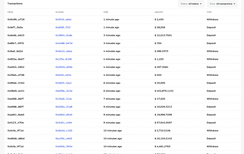

# BarnBridge

Barnbridge 是一个想法 &amp; 白皮书最初是在 2019 年第二季度构思的。当时，MakerDAO 开始获得主流意识，并激发了现在被称为 DeFi 或去中心化金融社区的想象力。 一年多后，全球 60% 的债务收益率不到 1% 和 超过 15 万亿美元的全球债务产生负利率，资本继续流入风险更高的收益率流。 这不是巧合，也不是趋势。 从历史上看，一直追溯到圣经时代，营运资金追逐收益，承担相对相等的风险。

BarnBridge 是一种风险代币化协议。它旨在降低与 DeFi 相关的风险，例如利率敏感性和市场价格波动风险。通过让用户选择风险概况，BarnBridge 可以通过代币化、流动性部分重新分配风险。BarnBridge 通过其 SMART Yield 和 SMART Alpha 产品做到了这一点，所有这些产品都针对特定的 DeFi 风险类别。

dApp 的持续开发由核心团队提供，并通过 BarnBridge DAO 由社区管理。

