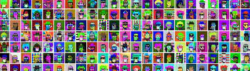
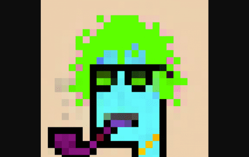

# Bastard Gan Punks V2

BASTARD GAN PUNKS 的第 2 版比 BOOMER CRYPTOPUNKS 和 BOOMER CRYPTOPUNKS 更酷、更好、更傻。 版本 1 混蛋 GAN 朋克。 这一次，所有 CRYPTOPUNK 属性都被提取出来，并用 GAN 训练了它们所有组合的新数据集，以生出更多的坏蛋。 每个人都有一个独特的故事，由超过 10K PUNK &amp; EMO歌曲歌词通过GPT-2语言处理算法。

混蛋正在慢慢地破坏世界。 采用一个来踢每个人的屁股！

免责声明：此项目与 LARVA LABS 无关

\> 对于 BGANPUNKS V2，我砍掉了所有 Cryptopunks 属性，制作了仅针对一种性别制作的跨性别副本（BGANPUNKS ARE QUEER！），将它们分类在不同的文件夹中（头发/头部、眼睛、眼镜、烟雾等） ，并编写了一个脚本来对这些特征进行所有可能的组合。我还添加了皮肤和配饰颜色随机化 + 一些我自己绘制的自定义特征。老实说，这是一个痛苦而糟糕的过程，因为我必须手动完成所有剪辑，并且必须通过反复试验来优化脚本，可能需要数百次，才能在最后制作不必要的 1000000 张图像，这将花费终生用我糟糕的 GPU 训练模型。

