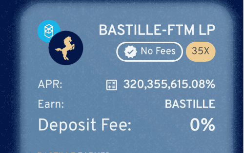
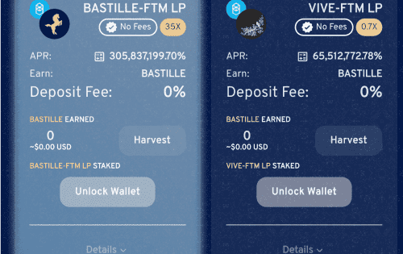

# Bastille De La Bouje

Bastille De La Bouje 是 Bouje Finance 生态系统的第三层，重新引入了坚实的 APR 重置概念，专注于用户的安全性和可持续性，此外还拥有动态 APR 结构，以最大限度地提高用户收益并为用户带来最高收益 . 这是一个收益农业项目，旨在帮助将 TVL 和流动性吸引到 Fantom 生态系统中。

## 布耶巴士底狱

攻占巴士底狱是法国大革命中最具**标志性的**时刻之一，人们能够占领代表法国王室权威的**巴士底狱。** Bastille 是 Bouje Finance 生态系统的第三层，重新引入了**坚实的 APR 重置**概念，专注于用户的**安全**和**可持续性**，此外还拥有**动态 APR 结构**，以最大限度地提高用户收益并为用户带来最高收益。

