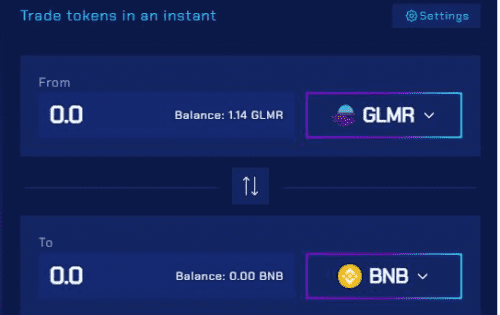
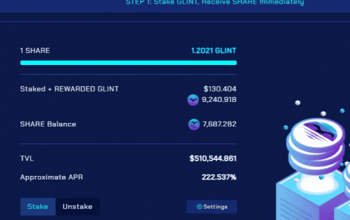

# Beamswap

Beamswap 是在 Moonbeam 链上具有自动做市商的去中心化交易所。 借助 Yield Farming / Bridge / Faucet Service / Launchpad / Syrup Pools 等各种其他功能，&nbsp;对于在 Moonbeam Chain 上寻找 Defi 的每个人来说，都有一些东西！

## 引入稳定 AMM 以实现更实惠、更高效的稳定币交易

标准 AMM 是 DEX 的支柱，但它们具有某些缺点和高额费用。为了降低交易稳定币的成本，我们将稳定 AMM 添加到 Beamswap DEX。

# 什么是稳定的 AMM？

或者更确切地说，AMM 是什么？一般来说，**自动做市商 (AMM)**是通过连接用户及其加密资产为所有去中心化交易所 (DEX) 提供动力的底层协议。它绕过了中介机构或中心化交易所，从而维持了一个去中心化的市场，用户可以在其中直接相互交换资产。

但并非所有 AMM 都是平等的。例如，标准 AMM 是许多 DEX 上使用的交换模型，包括 Uniswap。标准 AMM 非常适合支持持续流动性。然而，它不能维持有效的资本部署，这会导致掉期的高滑点，并最终导致最终用户的交易成本更高。

另一方面，**Stable AMM**减少滑点并为交换资产提供更好的利率。

为什么这很重要？

在 DEX 上交易非常频繁的一类加密资产是**相关资产或相同价值的资产。**正如他们的名字一样，这些是具有相同价值的相同资产的不同表示。最常见的是，这些包括稳定币或美元的各种表示形式，即 USDC、USDT、BUSD、DAI、FRAX，但也包括不同版本的 ETH、BTC、KSM 和其他加密货币。

