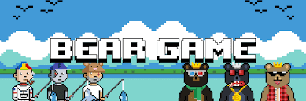
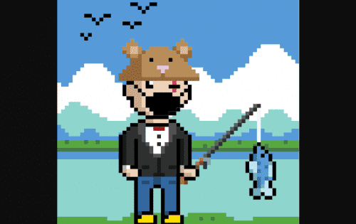

# Bear Game NFT

渔民和熊在大草原上争夺诱人的 $SALMON 奖品。 玩通过以太坊链为 NFT 持有者提供效用的游戏。 1 美元鲑鱼 = 1 美元鲑鱼。 $SALMON 在 SALMON Game 生态系统中没有其他功能，并且不能从 The Bear Game Developers 购买。 Opensea 上的持有者数量并不准确，因为许多 NFT 被用于游戏。

- Gen X 将永远只有 10,498 个，每个铸成 0.069420 ETH。39,502 个 Y 世代是通过养殖 $TROUT 铸造的。
- 渔民可以在河上押注以赚取 $TROUT，并在他们要求获得 $TROUT 的任何时间缴税。
- 如果一名渔民从河中撤出，熊队试图偷走其所有累积的 $TROUT。
- 当一个新的渔夫出生时，熊试图偷走它。如果他们成功了，它会被赠送给一只随机选择的熊，而不是铸造它的主人。

