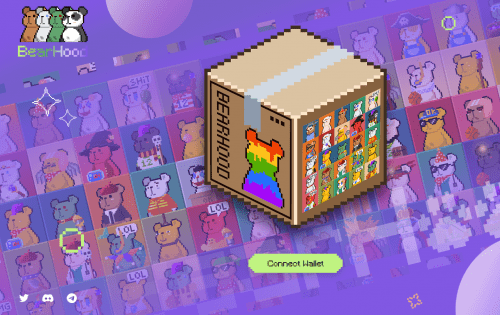

# Bearhood

Bearhood<strong>是10,000像素熊NFTs的集合——生活在区块链上的独特数字收藏品</strong>，旨在成为Web3浪潮下的像素收藏杰作。

2021 年初由 Pixel 粉丝组成的团队，BearHood 诞生于元界，并由此确定了它的定位至今。

像素通常被认为是数字图像中最小的单个组件。 这使得像素艺术经典，占用资源更少，更易于使用。 这些特点让 BearHood 更容易被接受，因为它具有 100 年后的复古美学。

熊熊是数百种艺术元素融合而成，每只熊都是独一无二的。

