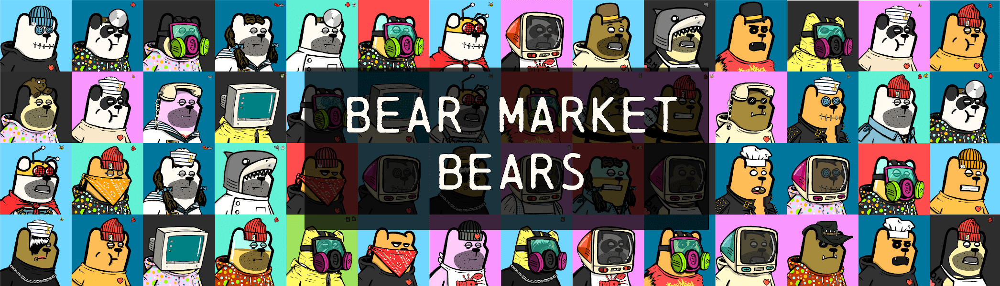

# Bear Market Bears - Official

Bear Market Bears 是第一个旨在度过漫长寒冷的 NFT 冬天的数字资产。Bear Market Bears 非常重视社区访问和协作，旨在让您和您一样拥有它们。拥有一只熊就是它自己的奖励。但以防万一我们也在计划一些真正的奖励😉。社区投票将有助于选择社区希望在完成的项目中看到的特征！分级稀有度或“熊”，将允许收藏家通过背景颜色轻松识别特征和“熊”，以及只有更高级别的熊才有的特征！来参加我们的 discord 并观看绘画课程，并与艺术家一起放松一下 lofi 节拍。参与社区范围的谜题并赢得奖励和 NFT。相互比较和交易熊，找到尖叫着“这就是我，如果我出生并养大一只穿着愚蠢的衣服和属性的熊”的熊。

