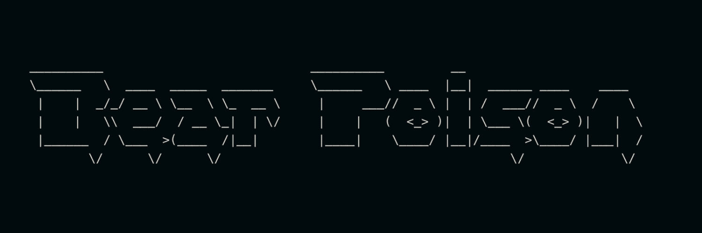

# Bear Poison

过去 7 天内没有出售熊毒药。▶ 什么是熊毒？高剂量的可可碱会对熊和其他物种产生毒性。据 Fish and Game 称，它的影响已经在狗、猫、啮齿动物和人类身上进行了研究和记录，但它对熊和其他野生动物物种的影响在很大程度上是未知的。

Bear Poison 是一个 NFT（非同质代币）集合。存储在区块链上的数字艺术品集合。

##### ▶ 熊毒代币有多少？

总共有 9 个熊毒 NFT。目前 9 位所有者的钱包中至少有一个熊毒 NTF。

##### ▶ 最近卖了多少熊毒？

过去 30 天内售出 0 个 Bear Poison NFT。

