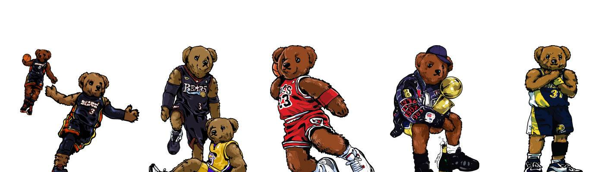

# Bears Club By KicksOnFire

Bears Club By KicksOnFire NFT 在过去 7 天内售出 4 次。Bears Club By KicksOnFire 的总销售额为 756.38 美元。一个 Bears Club By KicksOnFire NFT 的平均价格为 189.1 美元。有 459 名 Bears Club By KicksOnFire 所有者，总共拥有 5 个代币。

Bears Club 收藏了 5,555 只熊，以纪念历史上最具标志性的篮球时刻。灵感来自传奇人物、领导者、潮流引领者和开拓者的系列。加入我们的史诗之旅，解决运动鞋社区面临的问题。KicksOnFire NFT 共有 5 个 Bears Club。目前，459 位车主的钱包中至少有一个 Bears Club By KicksOnFire NTF。

