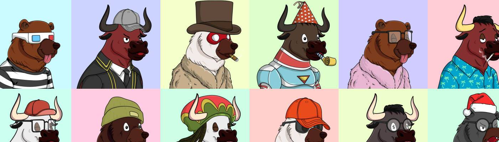

# Bears vs Bulls - Official

Bears vs Bulls 是一个不同的 10k 集合！在铸币厂，您可以选择熊市或牛市，因此熊市与牛市的比率取决于最初的铸币者。

然后，根据 ETH 的价格走势，空头或多头每周都会抽奖，抽奖金额高达 0.69 ETH。准备好一周了吗？公牛进场！一周下来？熊！

但要小心狼群……狼群是一种罕见的随机下降，他们既不看跌也不看涨——他们只是在追逐利润！这意味着狼队是通配符——他们每周都会参加抽签！

