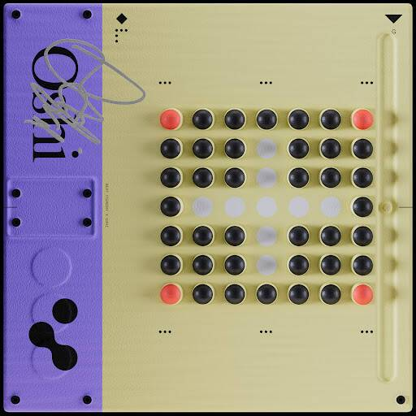

# Beat Foundry Season Pass

丹尼尔艾伦的“拼贴画”。
— 链上生成的电子复古节拍。所有 NFT 将在铸币后一周公布。— 为我们的持有者保留的免费薄荷，提前获得我们今年未来的收藏。丹尼尔艾伦的“拼贴画”。
—Oshi NFT 的 Bridges 在过去 7 天内售出 2 次。Bridges by Oshi 的总销售额为 105.45 美元。Oshi NFT 的一个 Bridges 的平均价格为 52.7 美元。Oshi 拥有者共有 313 座 Bridges，总供应量为 900 个代币。

Oshi 与 Beat Foundry 合作的第一个生成系列。用链上歌词击败 Foundry 的第一个系列。Oshi NFT 总共有 900 座桥梁。目前，313 位车主的钱包中至少有一个 Bridges by Oshi NTF。Oshi NFT 出售的最昂贵的 Bridges 是 [Bridge #735](https://www.nft-stats.com/asset/0x5fe218ba6f2b35225a63141c558bd4a606c42b46/735)。它于 2022-06-07（3 个月前）以 143.3 美元的价格售出

