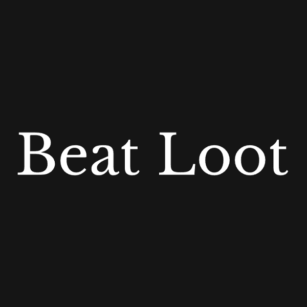

# BeatLoot

击败战利品

BeatLoot 是一个随机的节拍部分，图像存储在链中。
除了吉他、鼓、BPM 和琴键之外的其他部分被有意省略，以供其他人解读。
 BeatLoot 可以按照您喜欢的任何方式排列。请放心使用。

您的创作从这里开始

从这里开始：获取 BeatLoot

顶级吉他手和节拍制作者的节拍。这些节拍要去哪里？他们演奏什么样的音乐？收集 BeatLoots，感受这句话，然后开始创作。专有的智能合约在 Polygon 链上创建和存储六个元素。
这六个元素是来自世界各地的吉他手和节拍制作者的乐句，以及乐曲的键和 BPM。通过将它们混合在一起，创建了一个节拍。

这些可以在 OpenSea 等 NFT 市场上交易，持有者将获得组合的权利。
它们可以通过流媒体或实体版本自由分享，也可以用作您的 YouTube 频道的背景音乐。

