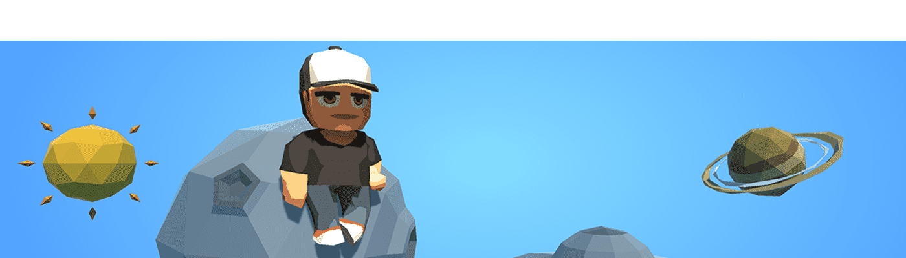

# Beats Boyz landing

总供应量是多少?
第一张专辑在多边形上仅限于 2000 个版本。这张专辑由10首不同的歌曲组成,提供20,000 个不同的代币。
如何铸造 NFT?
NFT 是预先设定好的。您可以立即在我们的 Opensea 市场上购买它们。请点击页面顶部的链接!
销售的不同阶段是什么?
在发行第一张专辑后,Crypto Minis 持有者和其他预选钱包将进行空投阶段。此阶段将伴随赠品以传播 Beats Boyz 的名称。空投后将开始公开发售:以低价预售100张 专辑。预售结束后,将发布完整系列。
铸造一个 NFT 需要多少钱?
在预售期间,NFT 的固定价格约为2美元。在公开发售期间,NFT 的累进价格将在5美元到 10 美元之间。价格将在出售时以 ETH 进行调整。

