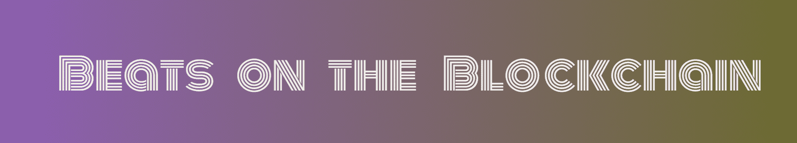

# Beats on the Blockchain

区块链上的 Beats 是在以太坊网络上推出的生成动画音乐 NFT，最大供应量为 3333 个 Beats。每个 NFT 都是独一无二的，它们的属性由 mint 上的 Solidity 合约分配。动画是使用 HTML 画布创建的，而音乐是由出色的艺术家在创作通用许可下提供的。该网站和动画生成代码托管在 IPFS 上。NFT 都是同一个链的，它们的一个最小的 Solidity 分配合约。它们的属性由 mint 上的 Solidity 合约分配。动画是使用 HTML 画布创建的，而音乐是由出色的艺术家在创作通用许可下提供的。该网站和动画生成代码托管在 IPFS 上。

