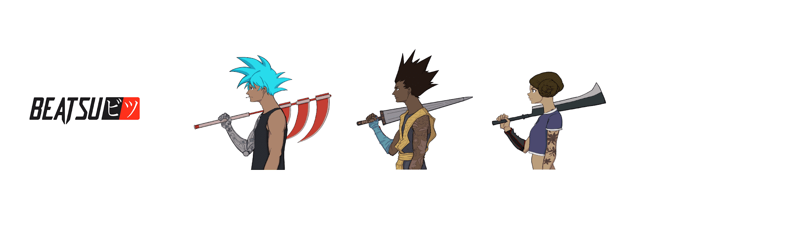

# Beatsu NFTs

Beatsu 是 888 个生成式音频/视频 NFT 的集合。

在五种不同类型的音乐中有超过一百万种可能的组合，每个 NFT 都将有一个完全独特的随机生成的节拍与随机生成的图像配对。只有丑陋的霓虹灯闪烁的灯光冲破黑暗。阴影是黑色的、变形的和可怕的。冷风带来许多声音：玻璃破碎、车辆逆火、低沉、不满的声音和空袭警报。持续不断的警笛声。

它并不总是这样。Magnus 到来的那一天，一切都变了。马格努斯。人工智能的表现如此先进，许多人认为它是神一样的。多年来，它在医学、农业、可再生能源、太空探索和老龄化方面取得了突破。但当这项技术落入坏人之手时，引发了一系列灾难性的事件，以至于 Etherwerld 的人口从 800 万减少到 888 名幸存者。由于无法就对使用 AI 的人进行报复的最佳方式达成一致，幸存者们分成了 5 个氏族，每个氏族都制定了自己的复仇计划。

