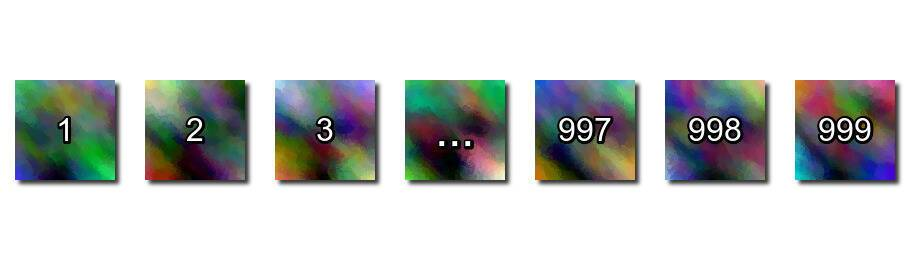

# Beautiful Numbers!

如果一个数字序列中的所有数字仅由 8 和 9 这两个数字组成，则该数字序列称为可爱序列。可爱序列的示例是：8、9、88、89、98、99……。等等。如果一个数字可以被可爱序列中的任何数字整除，那么它就被称为美丽的。例如：8（能被 8 整除）、9（能被 9 整除）、889（能被 889 整除）、10668（能被 889 整除）都是美丽的数字。给定一个数字 n，如果它可以被任何仅包含 8 或 9 或两者的数字整除，则编写代码打印“美丽”（不带引号），否则打印 -1。

这是我尝试过的python代码：

我使用了从 8 到 n/2 的 for 循环，并使用正则表达式检查数字是否仅包含 8 和 9。此代码适用于较小的数字，对于较大的数字，它会超出时间限制！这个问题有什么有效的解决方案吗？

