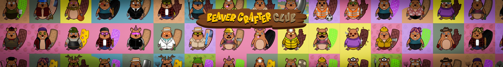

# Beaver Crafter Club

Beaver Crafter Club 是存储在以太坊区块链中的 10.000 个独特的 ERC721 代币的集合。

海狸是通过算法生成的，可通过视频游戏在他们自己的虚拟世界中用作角色。分为 7 大类的 210 个手工特性与未来的游戏玩法正确连接。

凭借长期的信任和 DAO，我们正在构建一个社交模拟游戏，作为我们社区的游乐场。一个由 10.000 只勤劳的海狸组成的俱乐部，收藏在 ETH 区块链上。正在开发的社交模拟游戏🚧 Mint 上线了🌲现在每个人都可以在我们的网站上或直接从我们的智能合约中铸造海狸！ 🚨

去海狸！   🌲

