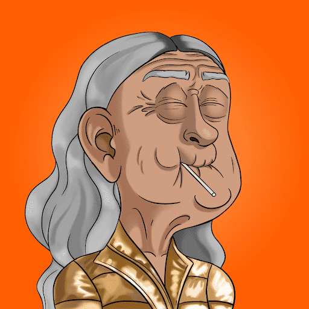

# BeckerDAO V2

前 750 个是免费的，然后 BeckerDAO NFT 每个 NFT 的成本为 0.015 eth。BeckerDAO NFT 将只有 1000 个。

BeckerDAO 是一项旨在颠覆创作者经济的全球草根运动。BeckerDAO 为人民服务，为人民服务。我们都为最醒的空房子加密时尚 nft 大师亿万富翁而感到兴奋，身体很热。不隶属于亚历克斯·贝克尔。▶ 什么是 BeckerDAO V2？

BeckerDAO V2 是一个 NFT（Non-fungible token）集合。存储在区块链上的数字艺术品集合。

##### ▶ 有多少 BeckerDAO V2 代币？

总共有 688 个 BeckerDAO V2 NFT。目前 76 位所有者的钱包中至少有一个 BeckerDAO V2 NTF。

##### ▶ 最近卖出了多少BeckerDAO V2？

过去 30 天内售出 0 个 BeckerDAO V2 NFT。

