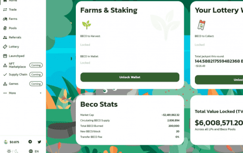

# BecoSwap

BecoSwap 是基于 KardiaChain 链网络开发的 DeFi 协议。 在该协议中，用户可以通过 Launchpad、Yield Farm、Lottery、NFT 市场等一系列令人兴奋的功能来赚取和赢得代币。 作为 KardiaChain 先锋计划亚军，BecoSwap 的设计宗旨是利用 DeFi 功能并扩展 KardiaChain 生态系统。 BecoSwap 的新颖之处在于通过智能合约算法运行的自我优化和无需许可的流动性池。

## 更多来自 BecoSwap

BecoSwap 是 KardiaChain 先锋计划的亚军。DeFi 协议通过 Launchpad、Game、Yield Farm、Lottery、NFT 帮助用户赚取和赢取代币
