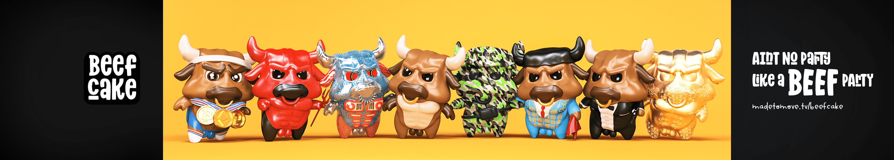

# Beef Cake

牛肉蛋糕是数字乙烯基公牛的 NFT（不可替代令牌）集合。他们有能力承担几乎任何事情。 Twitter 牛肉和辛辣模因，马斯克获得了最佳亿万富翁 memelord 的地位。为了庆祝 Elon 在互联网上的声名鹊起，世界“第一，因此也是最好的”模因艺术家 LushSux 很荣幸地向我们的家伙马斯克颁发了首届年度垃圾海报奖。LushSux 总是用模因和争议“打破互联网”，他的壁画中出现了一些文化界的大腕——50Cent、唐纳德特朗普、库尔特科本和波格丹诺夫双胞胎。在这个特殊的场合，LushSux 制作了三幅虚拟现实纪念壁画来纪念马斯克。这些作品将作为 NFT 铸造，免费提供给 Lushsux 的 DRP 会员持有人。凭借他在班克斯、村上隆和世界各地画廊的墙上的实物作品，LushSux 是第一位采用虚拟现实的涂鸦艺术家。2021年，Lush与SHDW Gallery合作，设立一系列跨洲专场，将涂鸦传奇带到

