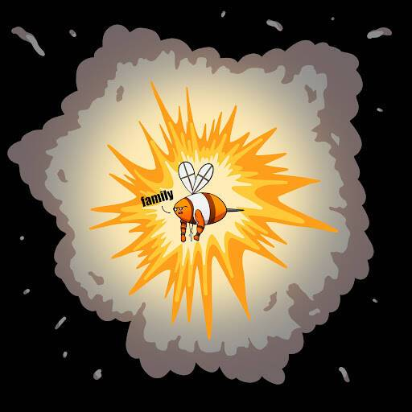

# BeeFrens

BeeFrens 是建立在[Bad Bears](https://badbears.io/)之上的以太坊上的一个新的免费薄荷集合。 每只蜜蜂每天产生 2 个 HUNNY。通过与 Bad Cub NFT 配对来增加您的 HUNNY 收益。 输入您的 HUNNY 即可赢取 NFT、加密货币、IRL 假期、商品等。BeeFrens NFT 在过去 7 天内售出 188 次。BeeFrens 的总销售额为 2.18 万美元。一份 BeeFrens NFT 的平均价格为 11.6 美元。BeeFrens 拥有者 2,361 名，总供应量为 8,888 个。

8,888 BeeFrens 努力让 HUNNY，您的链下抽奖券赢得大奖。建立在坏熊之上。

