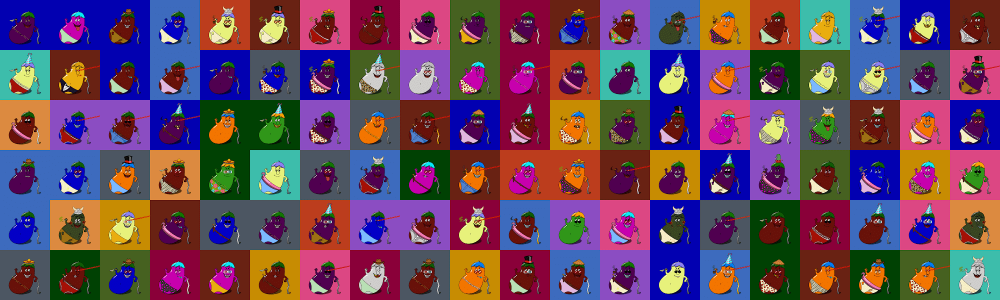

# BeepNFT

✤ 薄荷价格为零。您只需向矿工支付
汽油费 ✤ 每笔交易的最大 BEEP 为 9
✤ 有礼貌并设置适当的汽油费（快速/快速提示）
✤ 您的钱包必须在**以太**坊主网上乙坏蛋乙正常的乙ggplants (BEEP) 是以太坊区块链上 6,969 个独特的茄子 NFT 的集合。所有茄子都是免费的，等待铸造！可以肯定的是，您的 BEEP Eggplant 已准备好进行 BEEPing，并且绝对比其他 BEEP 更 BEEPer。

# 自由的

所有茄子都是免费的！0.00 以太币！只需支付汽油费并获得收益！

# 所有权

拥有茄子的所有商业和使用权利。以您想要的任何方式交易、使用或食用它们！你所做的一切都是自然的！

# 享受

永远不要忘记享受您独特的茄子。只有你的看起来像这样！你一直都知道，但现在你可以公开吹嘘它了！

## 蜂鸣设计

我们所有的茄子都是有机种植的，所有的特性都是自然产生的。我们相信完整和非转基因食品。我们支持我们的种植者和农民获得最大的收成，这样您就可以在每一口或舔一口中享受 BEEPest 的 BEEP！

我们在同一天将您的 BEEP 送到您家门口即时揭示. 与往常一样，请谨慎使用它们！！！这只是我们共同故事的开始。由于 BEEP 大多在其栖息地中单独发现并单独使用，因此作为 BEEP 农民，我们还没有官方的 Discord**服务器**。但是，Discord 将在我们达到路线图的第一个里程碑时开始。

