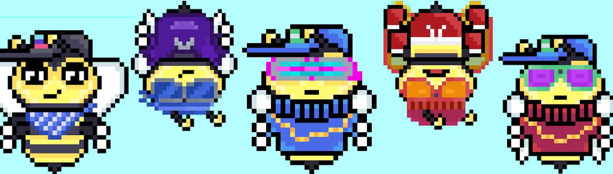

# Bees Deluxe

Bears Deluxe 是 6,900 个（不错的）算法生成的像素熊 NFT 的集合，它们生活在以太坊网络上

Bees Deluxe 是 20,700 个（不错的）算法生成的像素蜜蜂 NFT 的集合，它们生活在以太坊网络上

Honey Hives Deluxe 是生活在以太坊网络上的 6,900 个（漂亮）动画 NFT 的集合

VX Bears 是生活在以太坊网络上的 10,000 个 3D 可控和启用元节的体素化身的集合每个 Bears Deluxe 每天累积 1 个 $HONEYD 代
币。无需质押！
在您方便的时候领取！每个 Bees Deluxe 每天累积 0.13 $HONEYD 代
币。升级你的蜜蜂以
增加 $HONEYD 的产量！最高等级为 5

