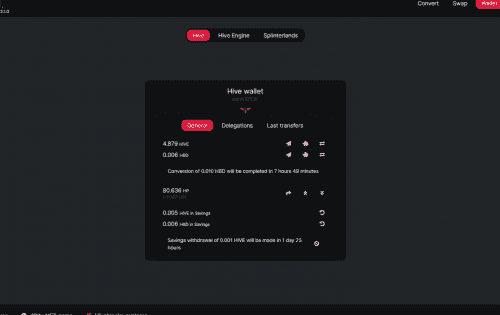
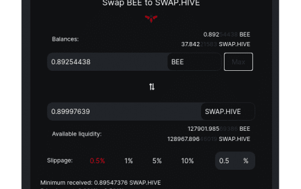

# BeeSwap

Beeswap 是一个应用程序，它允许廉价 (0.25%) 向 hive 引擎存款/取款，而无需改变整个 SWAP.HIVE:HIVE 流动性的大小。 这是原生区块链代币 HIVE 和 hive-engine 侧链 SWAP.HIVE 上的等价物之间的桥梁服务。

## 什么是 BeeSwap (BEE) | 什么是 BeeSwap 代币 | 什么是 BEE 代币

#### **什么是蜜蜂交换？**

BeeSwap 是 HECO 开发的基于 NFT-DAO 底层治理架构的 DeFi 平台应用。通过场景和流量赋能，打造集孵化游戏、优质NFT项目、拍卖交易为一体的基础设施。

BeeSwap 是由 ERC20 开发的基于 NFT-DAO 底层治理架构的自动化做市去中心化交易所。

BeeSwap 旨在打破公共区块链之间的障碍。我们开通更多跨链流动性交易，从而为更多客户提供流动性服务。我们还采用CFMM系统实现自动交易，奖励LP，让BeeSwap用户体验低续费、低滑点、高效的DEX平台服务。

