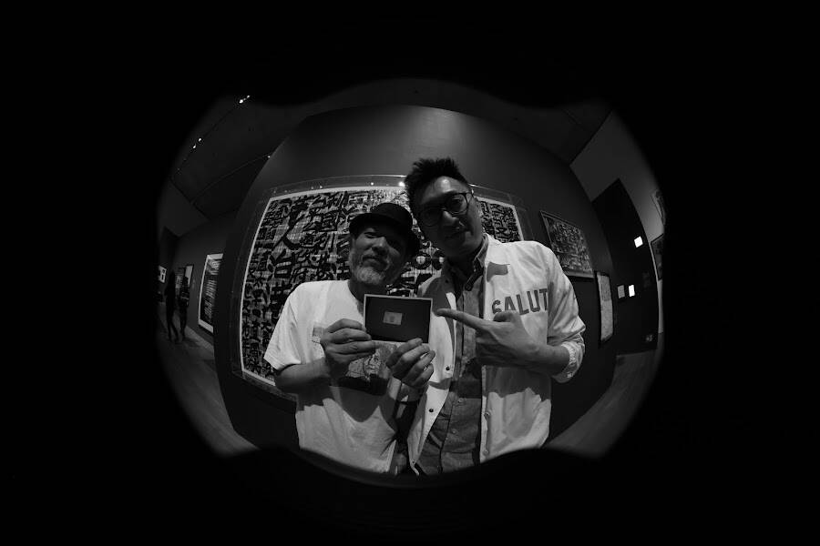

# Being Kowloon Emperor

钱，经济地位的肯定，所有钞票一律平等；身份证，政治权利的确认，有些身份却比其他身份更平等。

半世纪前，普普艺术之父以金钱为主题，透过丝印技术复制出反映美国梦的金钱本色。为什么当年安迪华荷复制一元纸币？最简单直接的答案，是因为爱财：

“It was on one of those evenings when I'd asked around ten or fifteen people for suggestions that finally one lady friend of mine asked me the right question: 'Well, what do you love most?' That's how I started painting money.” – Andy Warhol, 1962

群众和复制，乃现代主义两大元素。问题是，为什么当年安迪华荷只谄媚消费主义，而不同时复制美国人的政治身份认同呢？答案更简单直接：美国人从来没有身份证！原来，钞票有过千年历史，身份证却是上世纪才普及。时至今日，38个经济合作暨发展组织的成员国当中，6个还是没有身份证。以英国为例，身份证是上世纪两次世界大战期间英国人政治权利的确认。战后，英国人取消了身份证，英女皇更连护照也没有。

作为英国殖民地，香港在1949年推出身份证是对当时难民潮的回应。自1952年，没有身份证的英女皇的肖像曾出现过在英国、加拿大、澳洲、新西兰、巴哈马等10多个国家或地区的钞票上，香港亦是其中一份子。又是为了宣示主权，「九龙皇帝」的墨宝亦曾遍布全港，曾灶财的肖像却只出现过在他的身份证上。九龙皇帝跨越97的第二代电脑身份证，历史上有其此时此地的「灵光」（aura）。

爱财，更爱曾灶财。在数码复制时代的艺术作品，已消逝的灵光因区块链技术得以再次发亮。2022年4月1日愚人娱己，此时此地让全民披上国皇的ID。Being Kowloon Emperor，让全港市民透过NFT拥有九龙皇帝的身份，因为You don't know how lucky you are being a monkey. Because consciousness is a terrible curse. I think. I feel. I suffer.

