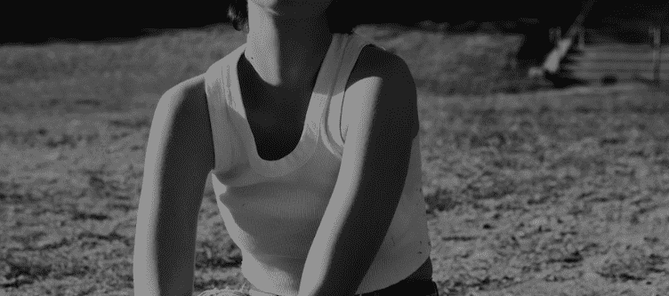

# Being-There-Sound

由在声音上创建。[在https://www.sound.xyz/beingthere 对这](https://www.sound.xyz/beingthere)首歌发表评论▶ 什么是现场声音？以及乐谱的使用
在那里 1979 年彼得·塞勒斯的讽刺喜剧是我一直以来最喜欢的电影之一。

塞勒斯扮演一个心理非常简单的人，他一生都受到庇护。当他的恩人去世时，他被赶出他长大的房子。他所知道的关于生活和外界的一切都是他从电视上看到的。这种知识被扭曲是可以理解的。

Being-There-Sound 是一个 NFT（非同质代币）集合。存储在区块链上的数字艺术品集合。

##### ▶ 存在多少Being-There-Sound 代币？

总共有 25 个Being-There-Sound NFT。目前，22 位所有者的钱包中至少有一个Being-There-Sound NTF。

##### ▶ 最近卖出了多少Being-There-Sound？

过去 30 天内售出了 0 个 Being-There-Sound NFT。

