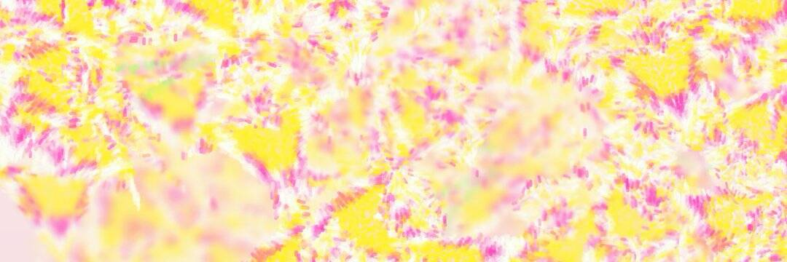

# Ben Snell

对🌸嘉德丽雅的制作感到好奇吗？今天美国东部时间下午 2 点，我将介绍它的代码和一些新的演示
@artblocks_io，刚看了
@snellicious_
 背后的代码演练
@artblocks_io
 Cattleya 项目，他所经历的细节和复杂程度令人惊叹。

*这篇文章反映了我在生成艺术作品*[*Cattleya*](https://bensnell.io/cattleya)*背后的灵感和过程。最初在*[*Art Blocks*](https://artblocks.io/project/308)*上发布，现在在*[*OpenSea*](https://opensea.io/collection/cattleya-by-ben-snell)*上可用。*兰花热病

## 我如何将我的痴迷转化为无尽的兰花发生器艺术一直是我存在的决定性部分，但在 2020 年初，我失去了创作的冲动。对美术的商业主义和政治幻想破灭后，我退回到一种更安静的职业与工作生活平衡中，将精力转移到设计博物馆、开发软件和周末徒步旅行上。

在北部的森林里，我感觉最自在。不幸的是，在纽约市，更接近自然意味着将自然带给你，即将不快乐的植物囤积在一个狭小的黑暗房间里，但这通常比盯着一堵砖墙要好。所以，从字面上看，我把我的泡泡变成了温室。（“泡泡”指的是我为容纳灰尘和烟雾而建造的塑料雕塑制作“工作室”。）

