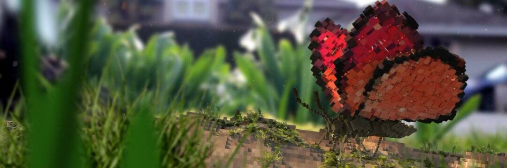

# Bengs Art

经过 

[本萨尔](https://opensea.io/bengsart?tab=created)

视觉特效/动画/版画/数字资产

宗教、政治和文化为叙事驱动的艺术提供了无穷无尽的灵感来源。残暴、腐败、不公正、歧视、无知、真实新闻、假新闻、奴隶制、种族主义、贩卖人口、气候变化、大规模灭绝，以 4k 格式传输，通过宽带流式传输，直冲我们的喉咙，直到我们对新的事物完全麻木十年前会吓到我们的正常现象。 

我的作品试图审视当前的社会气候、影响像我这样的人的新闻和问题，并以一种用有趣的图形吸引你的方式来描绘它们，然后在你已经被吸引时用信息抓住你。

感谢您的光临，希望您喜欢您所看到的。

