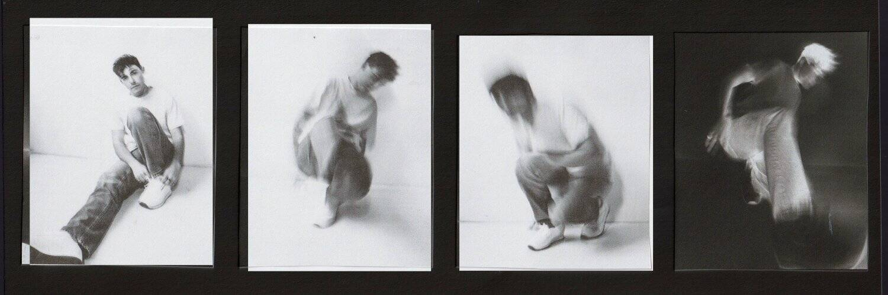

# Concrete by Decent.xyz

经过
去中心化
Ben Kessler 将 25% 的版税收入用于他的歌曲 Concrete，该歌曲已在平台上播放超过 100 万次。每个 NFT 将被铸造成 0.1 ETH，并且可以在 3 年后（从 2022 年 3 月 10 日开始）用 Decent 兑换。通过拥有 Concrete NFT，您直接支持 Ben Kessler，为他们提供资金来记录和营销他即将推出的项目。在体面的.xyz 了解更多信息

旧系统通过剥夺艺术家的权利来运作。新系统将通过给予他们更多来发挥作用。Decent 通过列出 NFT 使艺术家能够从他们的粉丝那里获得资金并与他们建立社区。我们的使命是加速艺术家的成长并帮助他们*拥有*自己的事业。音乐家上传曲目并挑选他们的粉丝收到的版税。艺术家发布代表他们上传歌曲的 NFT，粉丝可以购买这些 NFT 来支持艺术家并分享他们的成功。

通过版税和 NFT 交易，每个人都因帮助他们喜欢的音乐和艺术家成长而获得奖励。艺术家在音乐行业面临着巨大的进入壁垒。我们的使命是加速艺术家的成长，帮助他们从职业生涯中获取更多价值。正如流媒体平台使观众民主化一样，我们的目标是通过 Decent 实现所有权和参与民主化。

