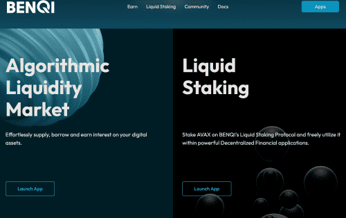
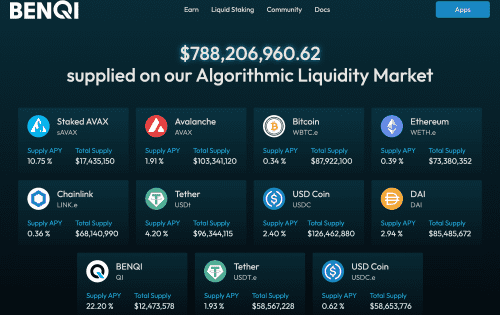

# Benqi

BENQI 是基于 Avalanche 的去中心化金融 (DeFi) 流动性市场协议。 BENQI 协议包括： &nbsp;<strong>1. BENQI Liquidity Market (BLM) 2. BENQI Liquid Staking (BLS) </strong><strong>BENQI Liquidity Market (BLM)</strong>协议让用户可以毫不费力地用他们的数字资产借贷和赚取利息。 向协议提供流动性的存款人可能会获得被动收入，而借款人则能够以超额抵押的方式借款。 &nbsp;<strong>BENQI 流动性质押 (BLS)</strong> 协议是一种流动性质押解决方案，可将质押的 AVAX 代币化，以授予用户在去中心化金融应用程序中利用收益资产的能力。

