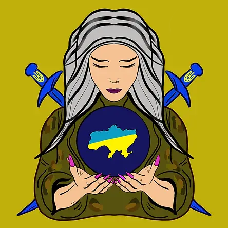

# BerehyniaNFT

DOUBLE TOP 和免费的乌克兰加密社区的收藏。由 sibileva.eth 设计。

我们的 NFT 收藏与战争无关。这是关于保护我们的家庭并向我们展示爱的乌克兰妇女。我们为这份爱而生，为之而战。这个 NFT 集合由 2402 个元素组成。乌克兰战争于 2022 年 2 月 24 日开始。每个 NFT 的价格为 0.05 ETH。它包括 2.5% 的特许权使用费，将转为捐赠。

从出售 NFT 中获得的所有资金将立即用于帮助乌克兰军队和平民免受伤害。我们还将不断报告我们的捐款。

