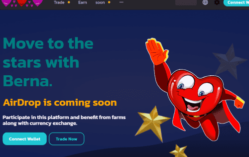
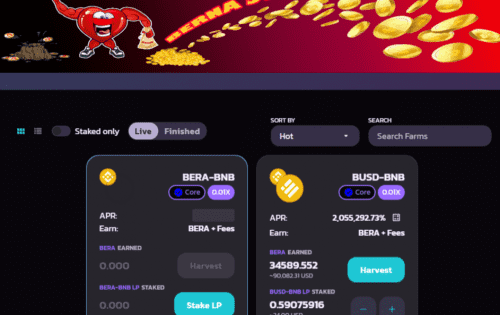

# BernaSwap

BERA 代币是 BernaSwap 生态系统的核心。 购买、种植、消费、分享，甚至可以用自己的品牌制作新代币&nbsp;

## BernaSwap 生态系统。

BERA 是 BERNASWAP 的治理代币。合约地址 BERA 代币 = (0xa76a484658192cac6a0B7D135699BE2C480929aB ) 十进制 18

## 价值观

**可访问性：**我们为用户创建工具来利用 DeFi 机会，无论背景、财富或经验如何。

**透明度：**我们通过社区驱动的治理和透明的流程共同构建，以确保我们的用户了解我们的集体目标。

**安全性：**我们的首要任务是最大限度地保障用户资金、合作伙伴项目和社区的安全

# **特征**

- 

  **流动性：**将代币添加到流动性池并接收LP代币

- 

  **农场：**质押 LP 代币，赚取免费 BERA

- 

  **矿池：**质押BERA，赚取免费代币

  - **自动复合**BERA-BERA Snack Pool

- **持有：**锁定代币一段时间，获得固定APY的代币

- **IDO（Initial DEX Offering）：**以USDT为您的项目筹集资金

- **IFO（Initial Farm Offering）：**以 BERA-USDT LP 代币为您的项目筹集资金。赎回LP代币后，USDT分配给项目，BERA被烧毁

- **NFT 生态系统：**收藏品、市场等。铸币厂、股权和交易——BERA 的消费

  - 

- **DAO：**参与治理并对提案进行投票 - 由 BERA 投票

- **多链：**在其他区块链上启动并服务更多项目和用户

- 

  **制作代币：**以最低的成本建立一个拥有自己品牌的代币部分
