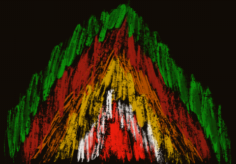

# berndawgler ohyouknowx

这些现在被“烧毁”了——也许你喜欢，也许不喜欢，但是你的空投已经被重新空投了。此系列不再提供空投。空气滴可以在这里找到。如果你想要空气滴。▶ 什么是 berndawgler 烧伤？

berndawgler 烧毁是一个 NFT（不可替代令牌）集合。存储在区块链上的数字艺术品集合。

##### ▶ 有多少 berndawgler 烧毁的代币？

总共有 70 个 berndawgler 烧毁了 NFT。目前，51 位车主的钱包中至少有一个 berndawgler 烧毁了 NTF。

##### ▶ 最昂贵的 berndawgler 烧卖是什么？

出售的最昂贵的 berndawgler 烧毁 NFT 是 [BURNED #60/69](https://www.nft-stats.com/asset/0x6ccd2f02ba658c0a778fc6df0bdb4a31bd8d1785/61)。它于 2022-06-07（3 个月前）以 179.6 美元的价格售出。

##### ▶ 最近卖了多少烧的berndawgler？

过去 30 天内售出了 1 个 berndawgler 烧毁的 NFT。

##### ▶ 什么是流行的 berndawgler 烧毁替代品？

许多拥有 berndawgler 烧毁 NFT 的用户还拥有 [Glowing Records-Tokens](https://www.nft-stats.com/collection/glowingrecords-tokens)、 [Gigamat Editions](https://www.nft-stats.com/collection/gigamat-editions)、 [D3AD 3ND](https://www.nft-stats.com/collection/d3ad3nd)和 [Iconoclasm 版本](https://www.nft-stats.com/collection/iconoclasm-editions)。

