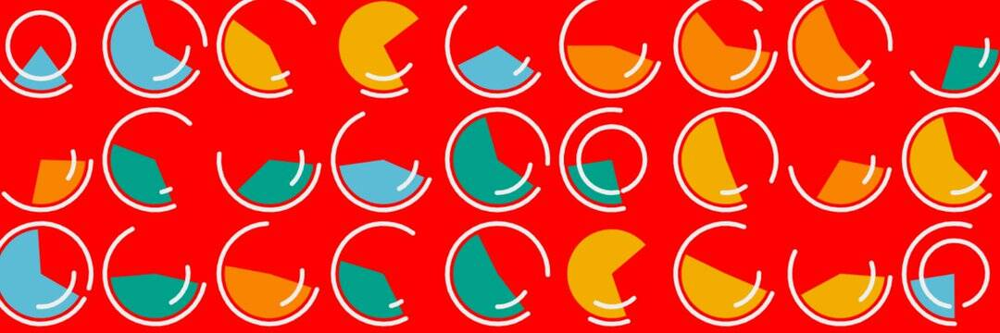

# Best Creature

想要为您的游戏物品、收藏品或其他 ERC721 物品提供即时、可定制的市场吗？你来对地方了。

本教程将向您展示如何从头到尾为您的商品构建店面。我们将引导您构建您的 ERC721 合同和元数据，在 OpenSea 上查看您的物品，并测试您的物品的拍卖流程。

在本教程结束时，您将了解如何与 OpenSea 集成并为您的项目创建自定义店面，就像本教程中的[OpenSea Creature 示例店面](https://testnets.opensea.io/collection/opensea-creature)一样。

介绍“NFT 链规则”

定义：meme 的价值与基于它的衍生产品的数量成正比。

