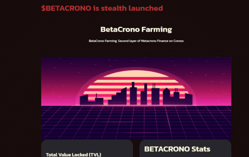
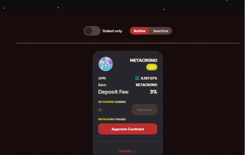

# BetaCrono Finance

BetaCrono 是 Metacrono Finance 在 Cronos 网络上的第 2 层。 BetaCrono 是一种通货紧缩的代币，销售税为 5%。 税款被发送到死地址&nbsp;

# BetaCrono 农业

BetaCrono Farming，Cronos 上 Metacrono Finance 的第二层

## 贝塔克罗诺统计

市值

38,929美元

铸造总量

1,333

总烧毁

67

流通供应

1,266

新 BETACRONO/块

0.0006

