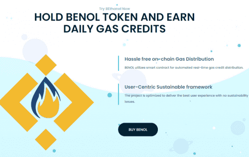
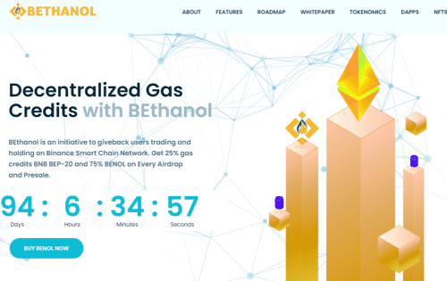

# BEthanol

使用 BEthanol 的去中心化 Gas Credits BEthanol 是一种创新的解决方案，它为用户提供自动化、实时、链上的 Gas Credits 分配模型，用于补偿交易和补偿。 交易费。 BEthanol 是一项回馈用户在币安智能链网络上交易和持有的倡议。 在每次空投和预售中获得 25% 的天然气信用 BNB BEP-20 和 75% 的 BENOL。

## 特征

### 经过广泛的研发，BENOL 团队设计了这个项目，以满足用户的满意度，同时消除最普遍的问题，使其用户可以在使用 gas 积分的同时获得无缝体验。

### 链上信用分配

BENOL 提供实时、链上的 Gas 信用分配模型，让整个过程去中心化，让信用分配免交易费。为了方便用户，信用分配将每天自动发生（在 7500 块或等值）

### 可持续框架

每笔交易将征收 8% 的交易税，并将平均分配给：LP 注入、奖励池、价格稳定机制和 Binance 的推荐支付。合约中将使用有条件的铸造和燃烧来保持奖励池的平衡。

### 价格稳定机制

与过时的项目不同，BENOL 将自动稳定其价格，这将有助于应对动荡的市场。该合约将根据市场情况自动买卖币安，以稳定 BENOL 代币的价格。

