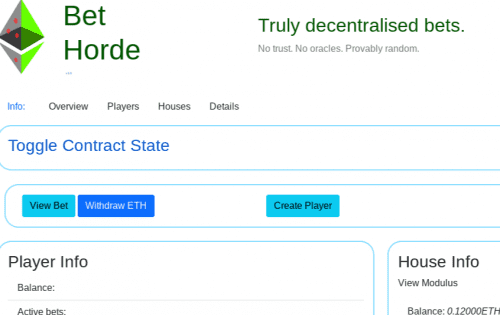

# BetHorde

BetHorde：真正去中心化的投注。 不可信。 没有神谕。 可证明是随机的。

任何 ETH 钱包都可以下注或接收赌注。 使用公钥加密（RSA 签名）创建的随机性。

玩家对Houses下注，而不是对 BetHorde。

##### 需要

仅适用于玩家奖金：

- 0%≤房屋占用≤10%。
- 合同采取：
  - 1.0%：奖金 < 0.1ETH
  - 0.5%：0.1ETH ≤ 奖金 < 1ETH
  - 0.2%：1ETH ≤ 奖金 < 5ETH
  - 0.1%：5ETH ≤ 奖金
- 如果赌注在 24 小时内没有被庄家解决，任何地址都可以强制玩家获胜并获得庄家**收益**。

##### 查看投注

**查看投注**按钮可用于查看尚未解决的投注详情。从这个角度来看，投注也可以由房屋解决（或者如果他们超过 24 小时，则强制解决）。

投注视图中的导航链接在针对特定房屋的投注中移动。

##### 随机性：

玩家选择获胜的**几率**并指定 要下注的**金额。**玩家有**1 / 赔率获胜**的机会，奖金等量**× 赔率**（减去房子和合同金额）。

下面的协议用于生成随机值：

1. 房屋在收到赌注之前共享 RSA 密钥的公共部分。
2. 玩家下注时提供随机值。
3. House 使用 RSA 密钥的私有部分对随机值进行签名。
4. 用于验证签名的 RSA 密钥的公共部分。
5. 签名用于生成随机结果。

.png)
