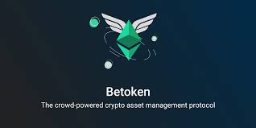
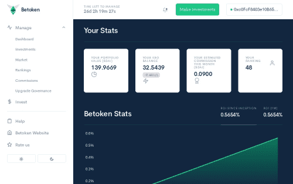

# Betoken

许多人有投资加密货币的资本但没有专业知识，还有许多人有专业知识但没有资本。 Betoken 是一种开源、社区拥有、无需许可且抗审查的协议，用于将资本与人才、人才与资本联系起来。 高枕无忧 您的资金会自动分配给 Betoken 的经理社区。 他们中的佼佼者将对资本的运作方式产生最大的影响。 节省时间和 努力 与 Melonport 和 eToro 等平台不同，您无需浪费时间选择表现最佳的公司并谨慎地在其中对冲资本。 所有 Betoken 经理都会在您睡觉时积极与市场进行交易。 最好的经理赚得最多 Betoken 协议通过向他们分配声誉单位（以 Kairo 代币计价）来识别和量化其加密交易者的才能，并根据他们的才能和贡献对他们进行经济奖励。

## 用户拥有，用户管理

Betoken 的治理系统监督协议变更和升级，并为新功能的开发提供资金。没有任何一家公司或个人可以控制该协议。它由使用它并从中受益的人——你——拥有和管理。 

## 主动管理

数以百计的 Betoken 经理为您积极防止损失，抓住盈利机会。您的资金将转换为积极管理的资产组合，即使是市场上最轻微的变化也能立即做出反应

## 全额抵押

当您将资金存入 Betoken 时，它会转换为 Betoken Share 代币。它代表您在 Betoken 基金中的所有权，并由智能合约中的抵押品完全支持。它们中的每一个都像一个代币化投资组合，包含 Betoken 经理买卖的基础代币。

## 没有最低要求。

无押金。只需 1、2 或 3 美元即可开始自动化您的加密投资组合。

