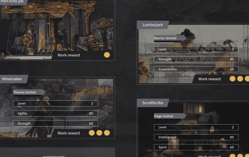

# BinaryX

Cyber Dragon 是一款基于 Binance Smart Chain 的游戏赚钱游戏。 该游戏由 BinaryX 团队提供。 玩家可以创造角色，收集稀有装备，挑战地下城。 最后的挑战是击败终极boss Cyber Dragon。 英雄通过击败龙获得龙宝库奖励。

Cyber Dragon 拥有 BNX + Gold 的双通证经济体系。 BNX 是 Cyber Dragon 的治理代币。 BNX 代币持有者可以参与社区治理和对重大游戏决策的投票。 黄金是 BEP-20 代币，是游戏中的主要货币。 游戏中大部分消费场景都可以使用金币，比如英雄需要消耗金币升级； 挑战地下城和准备装备时需要金币来支付费用。 也可以用金币雇佣其他玩家的英雄一起组队等。招募英雄后，通过参与日常工作，可以通过挖矿获得金币。

