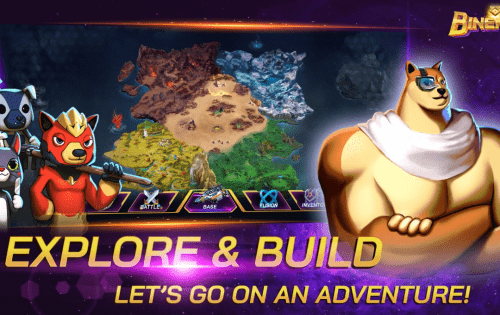
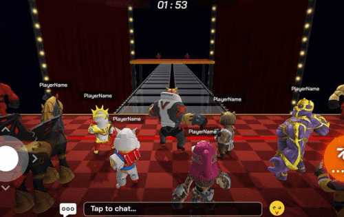

# Binemon

Binemon 是一款虚拟宠物 NFT 游戏，结合了 Idle RPG 游戏的元素。 除了收集和交易彩蛋外，珍宝（融合）、角色、物品、土地、玩家也可以在PVE、PVP模式中进行战斗，并获得加密货币奖励。

从一个想法开始，Binemon 团队从 2020 年 3 月开始部署该项目，并制定了在未来 3 年内完成基础设施的路线图。

#### 为什么是BINEMON？

## 房屋系统

如果城堡过于拥挤和要求苛刻，也许房子更适合一些个人空间。
你可以做你自己，表达你的独特性，并自我商业化。

##### 建造 你的房子

在 Bineland 选择一块地块来建造你的私人角落。

##### 装饰 你的房子

带出你内心的艺术家。您可以在这里和那里放置一些家具或商业广告

##### 商业化 你的房子

您可以出售您的房子或空间供其他玩家做广告。

