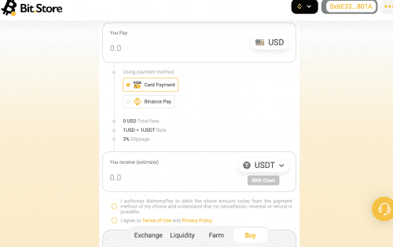

# Bit.StoreSwap

Bit.Store 是世界上第一个提供加密货币交易、SocialFi 功能和集成法定加密货币入口/出口功能的 Web3 投资平台。

该平台通过与广泛的区域支付提供商网络合作，支持不同的汇款方式，让用户可以快速轻松地进入全球数字货币市场。 该应用程序提供了多种功能，包括社交交易、关注和复制由该领域经验丰富的专家发布的交易策略，并允许专家通过他们对平台的贡献获利。 自推出市场以来，Bit.Store 一直在快速增长，并于 2021 年 12 月在欧洲和东南亚实现了 50 万活跃用户的里程碑。2022 年，Bit.Store 社区的全球市场快速扩张和增长仍在继续。 

