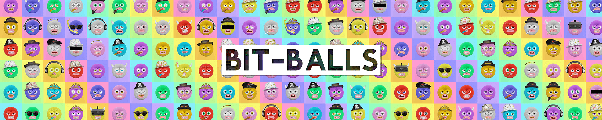

# Bit-Balls

Bit-Balls 的第一版 Origin Minting 包括 6,666 个程序生成的彩色伙伴，以及数百个受游戏文化启发的配件。

每个 Bit-Ball 都经过动画处理并以 3D 形式完全渲染。目标是让 Bit-Balls 活跃起来，以便与角色及其持有者建立有意义的联系。

##### ▶ 什么是比特球？

Bit-Balls 是一个 NFT（不可替代代币）集合。存储在区块链上的数字艺术品集合。

##### ▶ 有多少个 Bit-Balls 代币？

总共有 3,715 个 Bit-Balls NFT。目前，1,383 位所有者的钱包中至少有一个 Bit-Balls NTF。

##### ▶ 最近卖出了多少比特球？

过去 30 天内售出 0 个 Bit-Balls NFT。

##### ▶ 什么是流行的 Bit-Balls 替代品？

许多拥有 Bit-Balls NFT 的用户还拥有 [Friendly Frogs Official](https://www.nft-stats.com/collection/friendly-frogs-official)、 [KidPunks](https://www.nft-stats.com/collection/kidpunks)、 [MTE crazy alien](https://www.nft-stats.com/collection/mte-crazy-alien)和 Cuddly [Cubs](https://www.nft-stats.com/collection/cuddly-cubs)。

