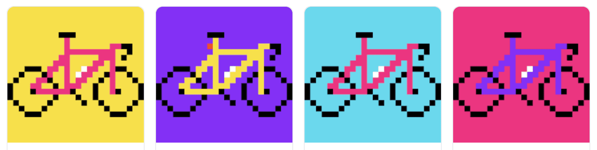

# BitBike

每个人都是独一无二的，具有不同的稀有性，每个人都有一辆 BitBike。有些自行车有特殊配件，如水瓶、马鞍包、尾灯和/或墨西哥卷饼包。限量 10,000

Polygon 的所有权证明，这是一个无气体区块链。无论如何，自行车不需要汽油。

颜色方案是计算机生成的，随机分配和有限的颜色。

艺术品细分： 20 背景选项 91 框架选项 3 曲柄选项 3 车轮选项 3 辐条选项 4 座椅选项 6 条带选项 6 轮毂选项

带有水瓶、尾灯、马鞍包和/或墨西哥卷饼包的任意组合的自行车更为罕见。只有 16 个，所有四个配件。

在 TWITTER、DISCORD 和 TELEGRAM 上加入社区

