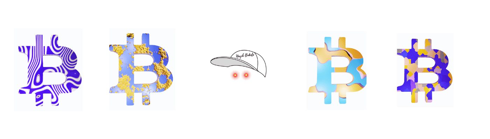

# BTC Intellectuals

比特币知识分子是以太坊区块链上最初供应的 214 个独特的 3D PFP 实用程序链接 NFT 的集合，这些 NFT 分为每个季节。所有比特币极简主义者的名字都作为元数据隐藏在以太坊区块链上。该系列是一系列独特的雕刻收藏头像

中本聪、埃隆·马斯克、迈克尔·J·塞勒、凯茜·伍德、马克斯·凯瑟、卡梅隆·温克莱沃斯、泰勒·温克莱沃斯、纳伊布·布克尔、杰克·多西。

这组 NFT 集合的灵感来自比特币接受地区的国旗颜色。

萨尔瓦多，乌克兰，东南亚，比特币极简主义者，菲登扎，F1。

纹理和颜色已被用作收藏艺术品或 Avatar NFT。

比特币知识分子持有者可以参与 NFT 认领、抽奖、社区赠品等专属活动。

